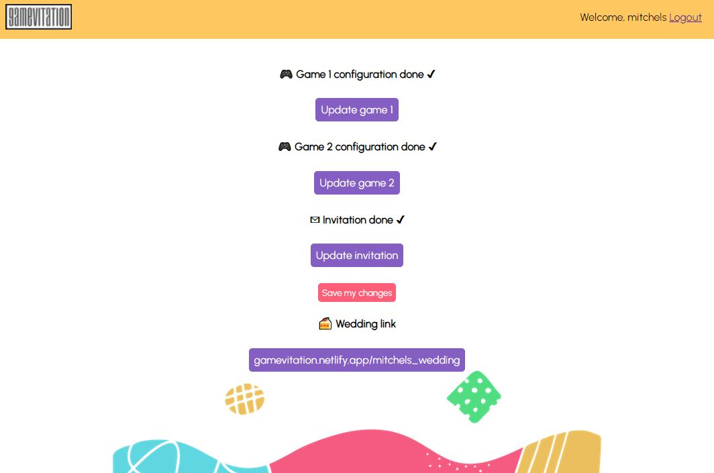

# gamevitation Server

Save and configure your gamevitations games

## Technologies

  - DB 
    * docker
    * postgresql
  
  - Frontend
    * React 
    * html canvas
    * chart.js

  - Backend 
    * django
    * django rest framework
  
  - Deployment 
    * Netlify
    * Heroku with postgresql addon

## Installation & Usage

### Installation

* Clone or download the repo.
* Open terminal and navigate to the project folder.
* Run pipenv shell to enter virtual environment (or virtual environment of your choice)
* Run pipenv install to install dependencies

### Usage

* Run docker-compose up on another terminal
* Run in the pipenv shell terminal pipenv run dev to launch
* Go to localhost:8000 to view the server app

## Endpoint routes USER

| Route          |  Description                                             |
| -------------- | ------------------------------------------------------- |
| /register |  show register (linked from client and login page)                 |
| /login    | Show Login page (home when nobody is logged in)
| /        | show the actual configuration of the game for that user and link to update config |
| /configuration        | Form to configurate the game or update |
| /settings | form to update user settings |

## REST endpoint routes API

| Route          | Data Required from front end                                           | Description                                             | Type   |
| -------------- | ---------------------------------------------------------------------- | ------------------------------------------------------- | ------ |
| /json/:game_id | not aplicable                                         | Return game configuration for specific id                 | GET   |
| /json/:game_id/scores | name of gamer and score of gamer                                        |  update the scores of a game with a new one                        | PATCH   |
| /json/:game_id/scores | not aplicable | Return updated scores (not whole object)                  | GET   |

## Database

  
<b>USER</b></sumary>

| Name | Type | Notes |
|------|------|-------|
| id | SERIAL | Primary key |
| name | varchar | Not null |
| email | email | Not null |
| password | password | Not null |

  
<b>GAME</b></sumary>

| Name | Type | Notes |
|------|------|-------|
| id | SERIAL | Primary key |
| date | timestamp | default = now |
| host_id | Foreign Key (user) | Not null |
| questions | ManyToMany(question) | Not null |
| character | Foreign Key (character) | Not null |
| invitation | Foreign Key (invitation) | Not null |
| scores | ManyToMany(score) | Null |

  
<b>QUESTION</b></sumary>

| Name | Type | Notes |
|------|------|-------|
| id | SERIAL | Primary key |
| question | varchar(500) | Not null |
| correct_answer | varchar(100) | Not null |
| incorrect_anwer | \[varchar(100)\]\(3\) | Not null |

  
<b>CHARACTER</b></sumary>

| Name | Type | Notes |
|------|------|-------|
| id | SERIAL | Primary key |
| hair_id | int | Not null |
| skin_id | int | Not null |
| dress_id | int | Not null |
| eyes_id | int | Not null |

  
<b>SCORE</b></sumary>

| Name | Type | Notes |
|------|------|-------|
| id | SERIAL | Primary key |
| name | varchar(100) | Not null |
| score | int | Not null |

  
<b>INVITATION</b></sumary>

| Name | Type | Notes |
|------|------|-------|
| id | SERIAL | Primary key |
| title | varchar(300) | Not null |
| message | varchar(500) | Not null |

## Licence

[MIT Licence](https://opensource.org/licenses/mit-license.php)
